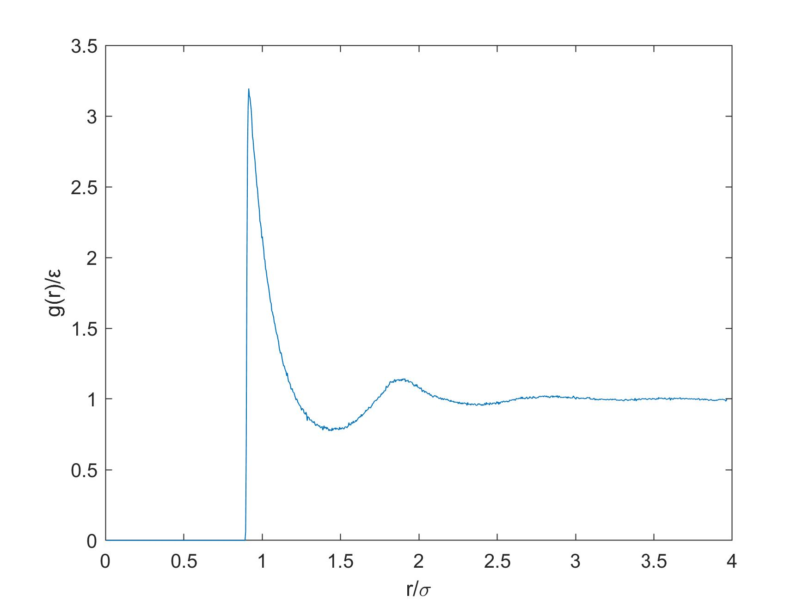

# StructureFactor

This code was specifically designed to perform a fourier transform on pair correlation data obtain from MCMC code adapted for a Yukawa potential. This code can be adapted for any pair correlation data, provided that the number density (rho) is changed and any normalizations are taken into account. The pair correlation data is read in a .txt file where the first column is r and the second column is g(r).

For any questions email: worrada@udel.edu
